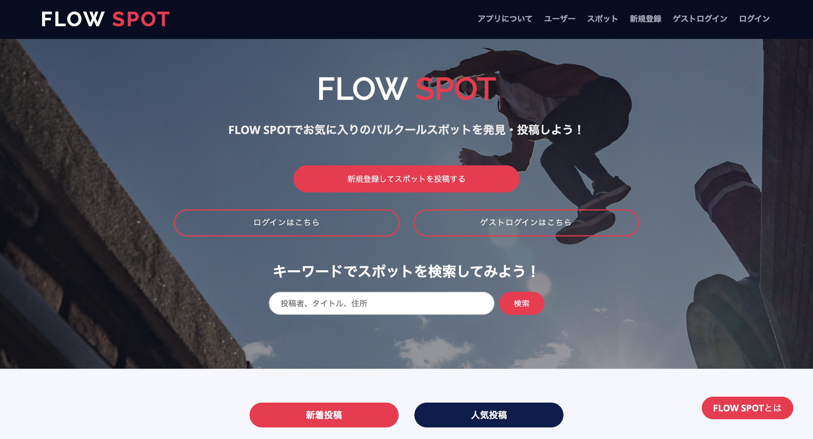
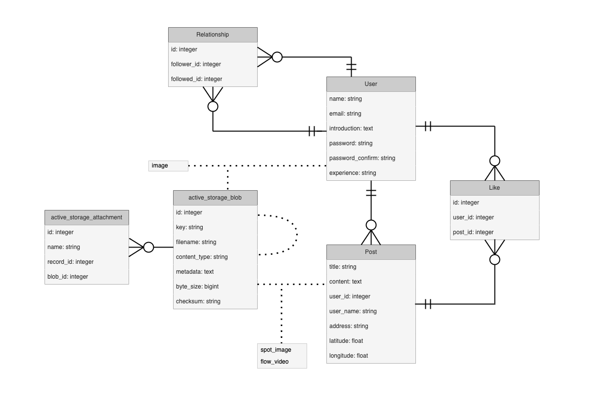
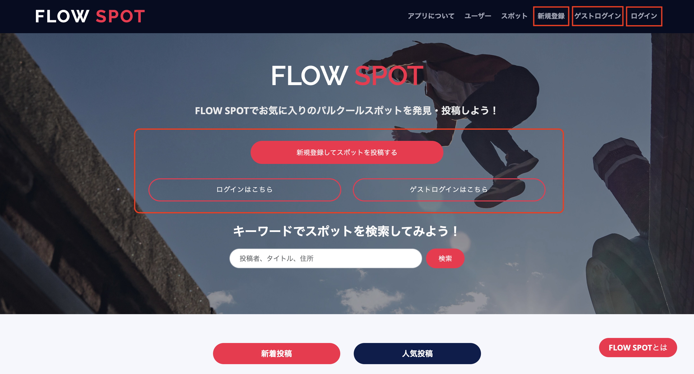
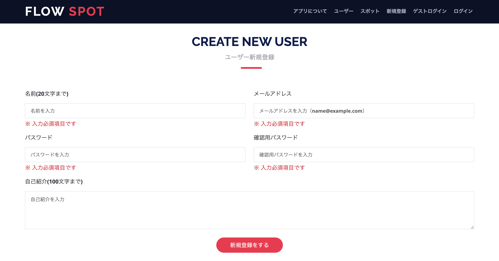
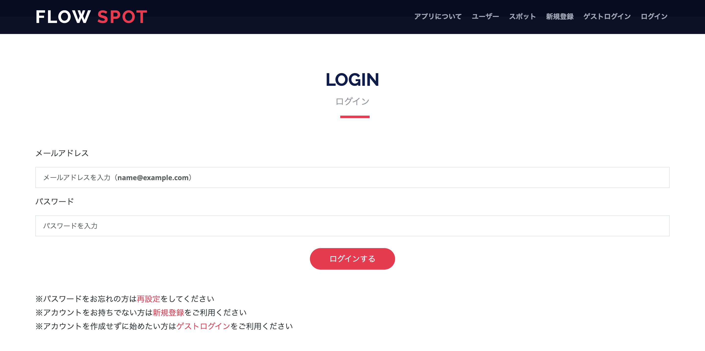
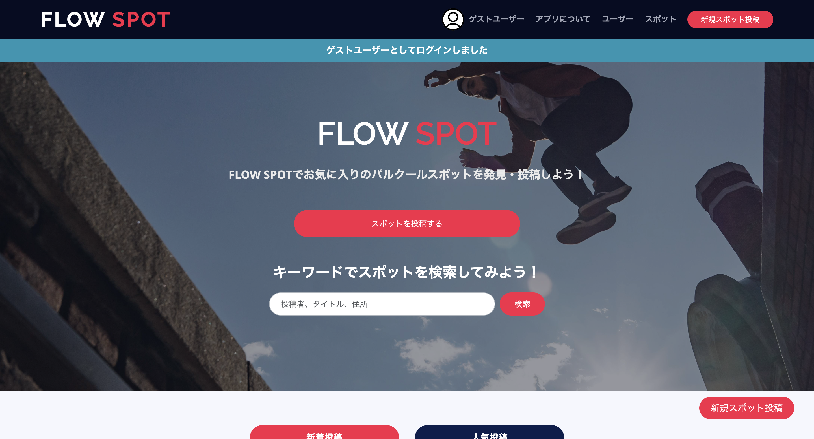
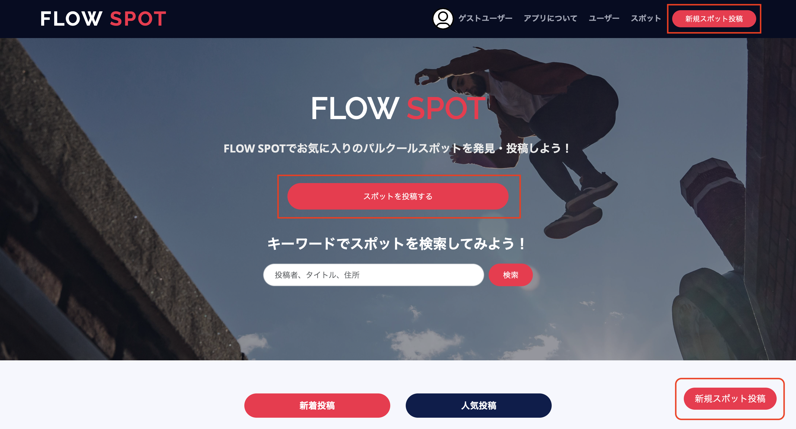
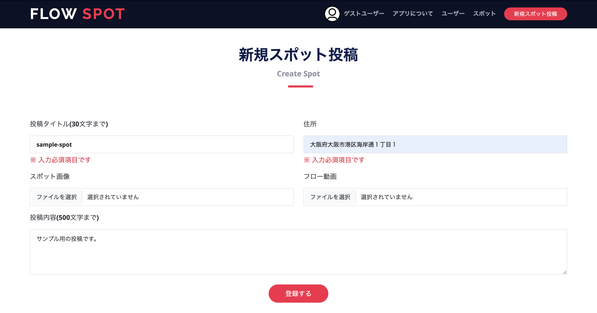
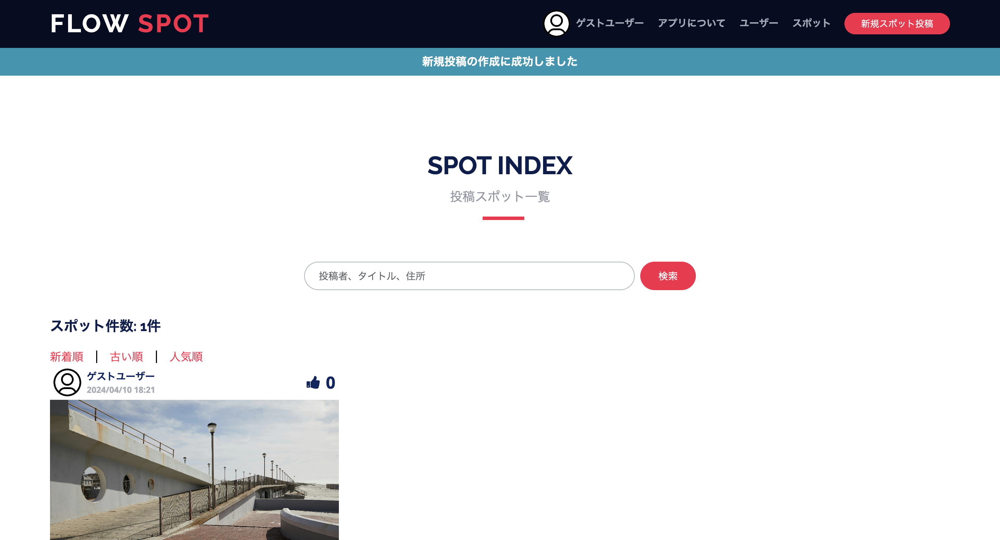
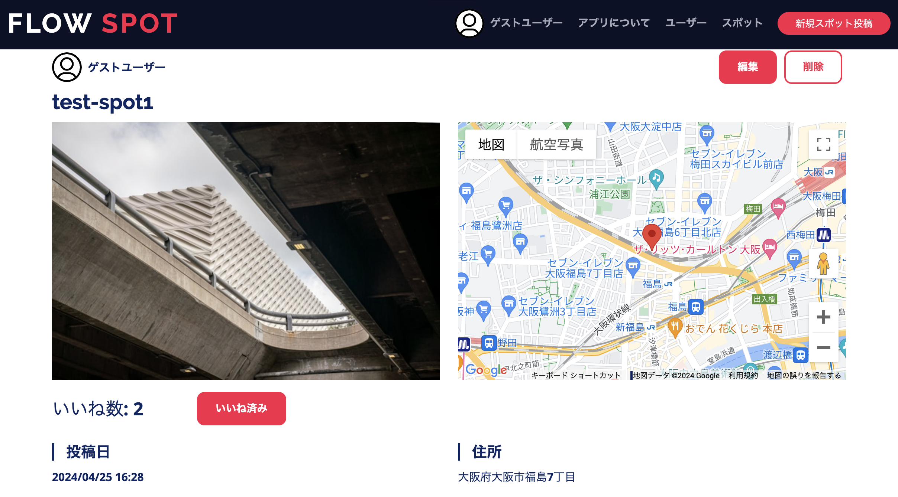

## アプリケーションの概要
パルクールをしている人たちの練習スポットを投稿・共有するアプリ。マップ機能と動画投稿機能を使う事で、具体的な場所を特定しつつ、そこで行う練習やフロー（一連の動き）をイメージさせやすくする。

アプリのURL: https://flow-spot-a3396b24d772.herokuapp.com/

## 使用している技術

## アプリケーションの機能一覧
* ユーザー機能
  * 新規登録、ログイン、ログアウト
  * ゲストログイン
  * ユーザー間のフォロー・フォロワー
  * パスワードリセット
* 投稿機能
  * 画像・動画投稿
  * google mapによる位置情報表示(google map apiを使用)
  * 投稿へのいいね
* ユーザー・投稿検索機能

## 実装したテスト内容
* systemspecによる結合テスト
* modelspecによるモデル単体テスト

## モデル全体のER図
 

## アプリ開発までの背景と収集情報
### 想定ユーザー
パルクールを野外で練習している10～30代男女
### 解決する課題
外でパルクールの練習をしたいが、近くに練習に適した場所が見つからない、あるいはどんな場所がいいのか分からない
### 解決方法
他の経験者が使っている練習スポットをマップで見ることが出来れば解決
### 製品
練習場所を見つけられるスポット共有アプリ

### 必要なページ
* トップページ
* アプリケーション紹介ページ
* 検索ページ
* ユーザー情報ページ
* ユーザー情報編集ページ
* お気に入りスポット一覧ページ
* 投稿詳細ページ
* 投稿情報編集ページ
* 投稿一覧ページ
* 投稿編集ページ
* 投稿詳細ページ

### 独自性（他に類似したアプリケーションがあるかどうか）
パルクールに関連したアプリケーションはまだ確認ができていないため、独自性は高い。現状としてはサイトで「おすすめスポット〇選」という名目で紹介されているのみ。また場所を紹介しているのみで、実際の動き等は参照することができない。

### 需要の高さ（そのアプリケーションを必要とする人数は多いか）
パルクールというマイナーなスポーツに特化させているため、需要は高くないと推測される。そもそもパルクールは怪我をしやすいスポーツであり、初心者にとって野外での練習はハードルが高い場合があるため、利用するユーザーが経験者に偏るる可能性あり。

## 使用方法(新規登録、ログイン)
* トップページまたはヘッダーメニューの新規登録・ログイン・ゲストログインを選択

* 新規登録の場合

入力必須項目である名前・メールアドレス・パスワードを入力して、「新規登録する」を押す

* ログインの場合

新規登録時に設定したメールアドレスとパスワードを入力して、「ログインする」を押す

* ゲストログインの場合

トップページまたはヘッダーメニューのゲストログインをクリック後、通常ログイン扱いとなり、（ユーザープロフィール編集を除く）全てのサービスが通常ユーザーと同じように使用可能となる

## 使用方法(スポット投稿)

①トップページまたはヘッダーメニューの「スポットを投稿する」または「新規スポット投稿」を押す

②入力必須項目であるタイトル・住所を入力した上で、「登録する」を押す

③投稿完了後、投稿一覧ページに作成した投稿が表示される

※画像を設定していない場合、デフォルトで用意されている画像が使用される

## 今後の課題について
### HTML & css
今回のアプリケーションのデザインにはbootstrapのテンプレートを使った。全体の骨組みとして使用するのは便利ではあった。しかしアプリケーションの機能の都合上、いくつかデザインを変える必要があり、その際にレスポンシブ対応やcssの指定・HTMLのタグ内のclassの書き換えなど、修正に手間のかかることが何度かあった。また修正したことで全体のデザインは整ったものになったが、cssのファイル内の記載が多少複雑になった。今後はファイル内の記載が複雑になりすぎないように、より簡潔なソースコードを目指す。

### JavaScript
スポット詳細ページにて、投稿するスポットの住所からgooglemapでその位置を表示する機能を実装した。googlemapをアプリ内で使うためのAPIキーの取得や専用gemのインストールといった、必要となる作業が多く、実装までに時間がかかった。functionの定義方法も理解するのに苦労したが、想定通りの仕上がりになった。今後開発を円滑に進めるためにも、JavaScriptの学習もrubyと並行してやっておく必要がある。

### Ruby
今回ポートフォリオとしてのアプリケーション作成ということで、自身の理解力を試すためにも可能な限りgemを使わずに機能を実装した。例えば、ユーザー機能を実装する際によく使われるgemである「Device」使用せずにログイン機能や新規登録機能を作成した。独自に作成したメソッドやバリデーションによって問題なく機能してくれたので、一定以上の理解をしていることを実感できて自信がついた。とはいえgemを使うことで開発時間の短縮にも繋がるので、複雑になることが想定される機能を実装する際には積極的にgemを導入することを検討するべきである。

### インフラ関連
デプロイをするためにheroku、画像と動画を保存するためにawsのS3を採用した。これらのサービスはカリキュラム受講時に使用していたものだが、改めて使い方やアプリケーションとの連携方法を何も見ないで実装しようとするとつまづくことが何度かあった。また、今回後から開発環境をDockerによる構築へ変更した。想定していた以上にスムーズに環境構築から立ち上げまでが成功したので、自分自身の技術的成長を実感できた。
